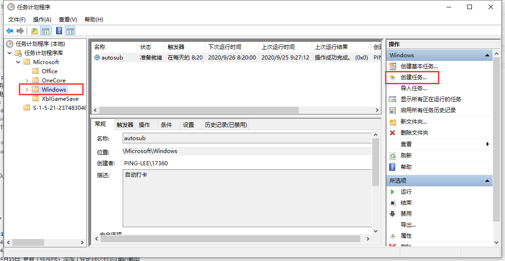
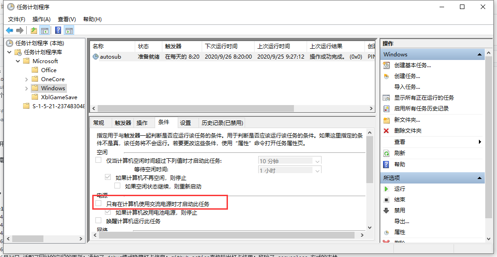

# ucas-covid19
国科大疫情防控每日填报助手，用于解决忘记填写企业微信中身体状况每日打卡的问题。


# 注意
本人不对因为滥用此程序造成的后果负责，**请在合理且合法的范围内使用本程序**。

**本程序仅用于解决忘记打卡这一问题，如果填报表中任意情况发生变化，比如地点发生变化，请务必在程序运行之前手动打卡。**


理论上来说本程序适用于**国内大多数高校**的每日打卡，只需要替换代码中的提交网址并完成其他的适配性工作即可，其他学校有需求的同学可以修改本代码，但请遵守`CC BY-NC-SA 3.0` 许可协议。


打卡网站可能会经常更新，因此代码会做更改。如果在使用过程中遇到问题或者发现 bug，可以提 issue 或者加入 [Telegram](https://t.me/ucas_covid19) 交流，代码更新也会在此处通知。
如果想要即时得知代码的更新请 watch 本仓库。


# 方法一： 使用自己的服务器运行
## 用法
1. 点击右上角`star` :)
2. 下载本项目到本地
3. 修改本地项目里面`sub.py`代码里面的sep账号和密码
4. （可选）填写[server酱](http://sc.ftqq.com/3.version)的api，填写之后可以在程序完成打卡之后通知到微信，如果不填写不影响使用
5. 上传`sub.py`到自己的服务器上，修改crontab，设定为每天八点半运行，注意需要修改以下命令的路径为实际路径。
```
30 8 * * * /usr/bin/python3  /root/ucas-covid19/sub.py >>/tmp/yqfk.log
```


## 建议
1. 定时时间设定到8:30，每天如果记起来了就手工填写，如果忘记了就由程序定时填写。填写的内容会和昨天的一致，地点也会保持昨天的地点不变。
2. 脚本运行所在的服务器的地理位置不会影响打卡的位置。
3. 如果手工完成了打卡，程序会显示今日已经打卡，不会影响之前手工打卡的结果。

## 注意
1. crontab会读取`/etc/localtime`的时区，而不是当前用户的时区，所以crontab里面的定时八点可能并不是UTC+8的早晨八点，解决方案是设置系统时区为UTC+8即可
```bash
TZ=Asia/Shanghai
ln -snf /usr/share/zoneinfo/$TZ /etc/localtime && echo $TZ > /etc/timezone
```


# 方法二： 使用 GitHub Actions（推荐使用）
没有服务器的同学可以使用 GitHub Action 来进行运行此程序。

**请勿**直接修改`sub.py`内的登录账号和密码，Github的公开仓库的内容可以被所有人查看。

Github提供了一个secret功能，用于存储密钥等敏感信息，请按照以下步骤操作。

使用步骤:
- 点击右上角 `star` :)
- 克隆这个仓库到你名下
- fork的仓库默认禁用了`workflow`，需要手动打开：点击 `actions`选项卡，点击`I understand my workflows, go ahead and run them`。
- 在仓库设置里面, 设置 secrets 如下
  - `SEP_USER_NAME`: 你的 SEP 用户名(邮箱)
  - `SEP_PASSWD`: 你的 SEP 密码
  - server酱通知设置（需要server酱通知时设置）：
    - `API_KEY`: 你的通知[server酱](http://sc.ftqq.com/3.version)的api key，填写之后可以在程序完成打卡之后通知到微信，如果不填写不影响使用
  - 邮件通知设置（需要邮件通知时设置）：
    - `SMTP_PORT`: 邮件服务器端口，不设置即为qq邮件服务器端口：465
    - `SMTP_SERVER`: 邮件服务器地址，不设置即为qq邮件服务器：smtp.qq.com
    - `SENDER_EMAIL`: 发送通知打卡通知邮件的邮箱，必须设置
    - `SENDER_EMAIL_PASSWD`: 发送通知打卡通知邮件的邮箱密码，需要开启邮箱smtp服务，此处可能不为邮箱的登录密码，如：qq邮箱为授权码，需要在设置中生成，必须设置
    - `RECEIVER_EMAIL`: 接收打卡通知邮件的邮箱，必须设置
- 测试actions是否可以正常工作：编辑本项目内任意文件，推荐修改`README.md`，比如添加一个空行，并提交以触发action运行，提交后的一分钟左右可以在action选项卡中看到运行记录


参考截图设定以上三个secrets，`API_KEY`可选。


完成之后, 每天 UTC 23:50 (北京时间 7:50) 自动触发github actions进行填报 。

# 方法三：使用Windows的任务计划程序（适合每天需要打开电脑来学习的同学）
不需要服务器，不需要了解`github actions`, 本地运行，不需担心sep账号密码泄露。

需要本地电脑安装python3，并且安装库pytz和requests，并设置好环境变量。
使用步骤：
- git clone 本仓库
- 修改`sub.py`中的SEP账号密码
- 创建一个`autosubWin.bat`文件，写入以下内容
```
@echo off
python3 \path\to\sub.py %具体路径替换成sub.py的路径%
%py -3 \path\to\sub.py 如果电脑同时装了python3和python2的话就使用这个。%
pause
```
- 搜索打开任务计划程序，按照下图在Windows目录下创建任务，事件设为执行autosubWin.bat,触发器设为每天早上固定时间就行
  

- 有一个需要注意的点，在条件那儿要注意看是否勾选了“只有在计算机使用交流电源时才启动此任务”，勾选了记得取消，不然电脑没在充电状态就不会执行这个任务

  
任务计划程序的设置会很直观，你还可以设置如果任务执行失败后多长时间再次尝试执行。需要注意的一点是，设定的时间最好能切合自己常打开电脑的时间。任务执行的时候，会弹出一个DOS窗口，执行完成之后关掉即可。


# 方案四：使用MacOS的crontab定时任务（适合每天需要打开电脑来学习的同学）
MacOS和Linux服务器操作类似，也是基于crontab。基本操作见`方案一`。与方案一稍微有点区别：①是需要创建一个文件，②是需要手动开启crontab服务，③是无需做时区调整操作。
1. 下载本项目到本地
2. 修改本地项目里面`sub.py`代码里面的sep账号和密码
3. （可选）填写[server酱](http://sc.ftqq.com/3.version)的api，填写之后可以在程序完成打卡之后通知到微信，如果不填写不影响使用
4. 创建 `/etc/crontab`
   
   查看com.vix.cron启动项的配置，注意里面有个KeepAlive的条件是 /etc/crontab 是否存在，存在才会执行。检查发现不存在，要手动创建：
```shell
$ sudo touch /etc/crontab
```
5. 启动crontab服务
```shell
$ sudo /usr/sbin/cron start

# 注：MacOS中crontab服务的启动、重启、关闭
#sudo /usr/sbin/cron start
#sudo /usr/sbin/cron restart
#sudo /usr/sbin/cron stop  
```
6. 修改crontab，设定为每天8:30、14:10、20:15运行，注意需要修改以下命令的路径为实际路径。(考虑到定时执行时可能正好电脑休眠或者没有网络，单次可能失败，故多次重复确保成功率)
```shell
$ crontab -e
```
```
30 8 * * * /usr/bin/python3  /root/ucas-covid19/sub.py >>/tmp/yqfk.log
10 14 * * * /usr/bin/python3  /root/ucas-covid19/sub.py >>/tmp/yqfk.log
15 20* * * /usr/bin/python3  /root/ucas-covid19/sub.py >>/tmp/yqfk.log
```

# 跋

只接受PR，不接受需求。

# changelog
- 2020年4月15日 添加了随机等待`10-600`秒之后再进行填报
- 2020年4月15日 添加了`user-agent`
- 2020年4月15日 更新了README，添加了设定secrets页面的截图
- 2020年6月12日 更新了README，提醒同学请勿直接在代码中填写密码
- 2020年6月14日 更新了README，添加有关触发action运行的说明
- 2020年6月24日 适配了网站的字段的更新；添加了 debug模式隐藏打卡信息；github action直接输出打卡结果；移除了 serverless 方式的支持
- 2020年9月16日 适配了网站的字段的更新
- 2020年9月26日 更新了README，添加了使用windows计划任务的操作步骤
- 2020年11月3日 更新了README，添加了 MacOS系统中 crontab 的配置方法
- 2020年11月6日 添加了 Telegram Group
- 2020年11月7日 使用环境变量传递口令，解决密码中存在特殊字符导致 sed 截断的问题
- 2020年11月9日 bugfix: 修复环境变量传递口令中存在的 bug， 经过测试已经 work 了，面壁思过中 :( 
- 2020年12月2日 网站证书配置有误导致打卡失败，修改代码为不验证证书
- 2020年12月22日 添加邮件通知


# 致谢
- 感谢 [karuboniru](https://github.com/IanSmith123/ucas-covid19/pull/1) 提供的github actions 支持
- 感谢 [tyfulcrum](https://github.com/IanSmith123/ucas-covid19/pull/2) 对文档的完善工作
- 感谢 [HsimWong](https://github.com/IanSmith123/ucas-covid19/pull/3) 对文档的完善工作
- 感谢 [spwpun](https://github.com/IanSmith123/ucas-covid19/pull/6) 添加了使用 windows 计划任务的操作步骤
- 感谢 [PrimeMHD ](https://github.com/IanSmith123/ucas-covid19/pull/7) 添加了使用 MacOS 的 crontab 的配置步骤
- 感谢 [T-winkle](https://github.com/IanSmith123/ucas-covid19/pull/24) 添加了邮件通知打卡结果的功能

<a rel="license" href="http://creativecommons.org/licenses/by-nc-sa/3.0/"></a><br />本作品采用<a rel="license" href="http://creativecommons.org/licenses/by-nc-sa/3.0/">知识共享署名-非商业性使用-相同方式共享 3.0 未本地化版本许可协议</a>进行许可。


Les1ie

2020-4-5 23:56:52
